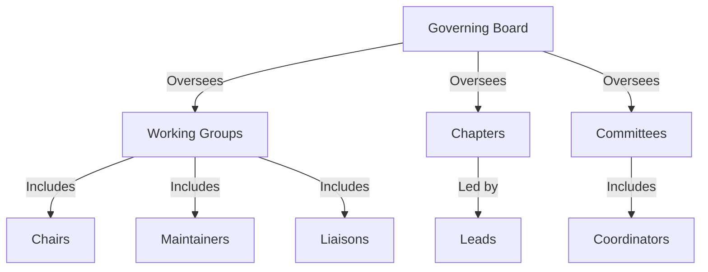

The KoG Project Charter provides our official governance materials including the project mission, responsibilities of the Governing Board, voting process, budget, and other details about the governance of the KoG project.

## Community Structure

The work within the KoG Community happens across a variety of different groups with a Governing Board to oversee this work, but much of the day-to-day work happens in our Working Groups, Chapters, and Committees as defined in the sections below.

Any KoG community member can participate in any of our WGs, Chapters, and Committees. We hope that participation in these groups will eventually allow community members to gain experience and move into leadership roles within the project as defined below.

### Organizational Chart

## Governing Board

The KoG Governing Board provides oversight for the entire KoG project as defined in the KoG Project Charter. New Governing Board members are selected by the existing Governing Board as defined in the KoG Project Charter.

However, much of the day-to-day work within the KoG Project is delegated to the various Working Groups, Chapters, and Committees defined below. Each of these has one or more people in “Leadership” roles who are responsible for coordinating the activities and may have responsibilities to appoint other roles as defined in the sections below.

## Working Groups (WG)

WGs are responsible for discussions, which can include development and maintenance of the respective working group intent and discussions about the working group intent. New WGs can be created with community consensus and are presented to the Governing Board to solicit feedback and/or concerns.

Each WG should have the following roles (the roles are defined in the Roles and Responsibilities section below):

- **Chairs (Leadership role)**: WGs must have at least one chair (ideally two), but can have more.
- **Maintainers (optional)**
- **Liaisons (optional)**

The full list of Working Groups can be found on the KoG website.

### Content Working Groups

These working groups are responsible for developing and maintaining content definitions and standards as well as discussing new content possibilities.

### Community Working Groups

Community WGs are groups of people who work towards community health. Community WGs are responsible for helping in community-related discussions, planning, and strengthening.

## Chapters

Chapters are geographically-based groups who drive awareness and activities for the KoG project within their region. This could include events, translation, and other activities. Whenever possible, Chapters are expected to collaborate within our Working Groups on activities that are ongoing within the KoG project.

Each chapter will have at least one Lead (Leadership role) who is responsible for coordinating activities for their region and recruiting other participants for their chapter. These chapter leads are staffed positions.

The current list of Chapters can be found on the KoG website.

## Roles and Responsibilities

With the exception of the Staff Positions, community members who have a history of participation within the project can move into the various leadership roles as defined below. Current leadership of the various groups can be found on the Teams at KoG page.

All of these roles are granted with some expectation of responsibility: they are people who care about the KoG project and want to help it grow and improve. These are not just people who can make changes, but people who have demonstrated their ability to collaborate with the team, get the most knowledgeable people to participate, make high-quality contributions, and follow through to resolve discussions. These are contributors to the project's success and citizens helping the project succeed.

### WG Chairs

Chairs set agendas, run meetings, and have maintainer responsibilities to make sure that the WG is keeping up with discussions. Chairs have write access to the GitHub repository/documentation for their WG.

#### Becoming a WG Chair

To become a chair, you should demonstrate the following:

- Commitment to the KoG project
- Participation in WG discussions, contributions, reviews, and meetings for a period of at least 6 months
- Ability to define agendas, write quality documentation, or make other substantial contributions to the community
- Ability to collaborate with the team
- Understanding of how the WG conducts its work (policies, processes, etc.)

New WG chairs are selected by consensus within the WG or within the community for newly forming WGs. If there is disagreement that cannot be resolved at this level, the decision should be escalated to the Governing Board.

### Liaisons

WGs, Committees, or Chapters may have a designated person responsible for liaising with other groups and providing input to all of the other groups as needed (e.g., communications, website, subprojects). With so many groups and activities across the KoG project, the Liaisons are how we keep the various groups in sync. In particular, these Liaisons play a critical role in creating feedback loops between our WGs and our committees to help the KoG project evolve our software to better meet the needs of the people using our software across various contexts.

#### Becoming a Liaison

To become a liaison, you should demonstrate the following:

- Commitment to the KoG project
- Participation in WG discussions, contributions, reviews, and meetings for a period of at least 3 months
- Ability to collaborate with the team
- Understanding of how the WG conducts its work (policies, processes, etc.)

New Liaisons are selected by Leadership for the Working Group, Committee, or Chapter to be represented.

## Removal

Anyone holding any role within the KoG project may resign at any time without giving a reason. The KoG community encourages members who hold a role to regularly assess if they plan to continue fulfilling their project duties and otherwise to resign.

Someone may also be removed after being inactive, failure to fulfill their responsibilities, violating the Code of Conduct, or other reasons. Inactivity is defined as a period of very low or no activity in the project for six months or more, with no schedule to return to full activity in that role. Involuntary removals are made by a vote of the Governing Board as defined in the KoG Project Charter.

## Meetings

Time zones permitting, people in the roles listed above are expected to participate in the KoG Quarterly Sync Meeting and any other meetings relevant to their area of responsibility. Details about these meetings can be found in the KoG Calendar.

## Code of Conduct

Code of Conduct violations by community members will be discussed and resolved by the Code of Conduct Enforcement Committee, which is appointed by the Governing Board.

## Modifications

Any modifications to this governance document are made by a vote of the Governing Board as defined in the KoG Project Charter.
