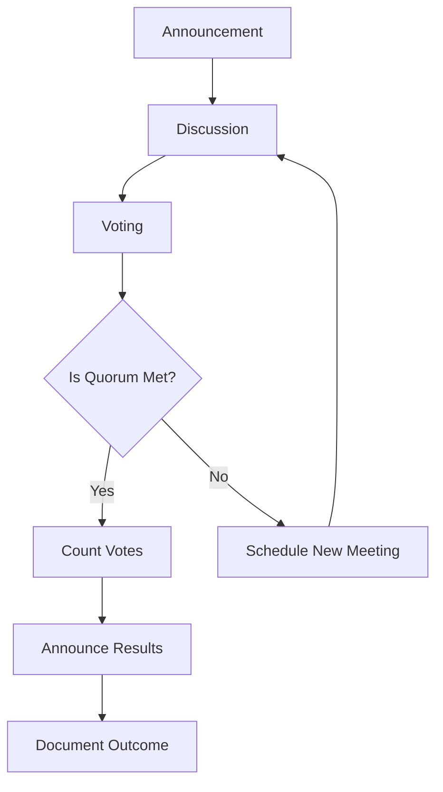

The KoG project strives to operate as a consensus-based community. However, if any decision requires a vote, the Governing Board (GB) and Committees follow a set procedure.

## General Rules

- **Voting Rights**: Each voting member has one vote.
- **Quorum**: Requires the presence of two-thirds of all voting members of the GB or respective Committee.
- **Decision-Making Capability**: Decisions can be made when the quorum is met.
- **Majority**: Decisions are made by the majority of voting members present.

## Voting Procedure

1. **Announcement**: The vote is placed on the agenda and communicated to all members.
2. **Discussion**: Open discussion on the matter to be decided.
3. **Voting**: Members cast their votes.
4. **Evaluation**: Votes are counted, and the result is determined.
5. **Announcement of Results**: The outcome is communicated to all members.
6. **Documentation**: The voting result is recorded and archived.

## Electronic Voting

- Decisions can also be made without a meeting through electronic voting.
- Requires a majority of all voting members of the GB or Committee.

## Procedure for Disagreements

- **Within Committees**: If a vote cannot be resolved, the GB decides the matter.
- **Within the GB**: In case of disagreements, any GB voting member can refer the matter to Kaosphere for assistance.

## Diagrams

