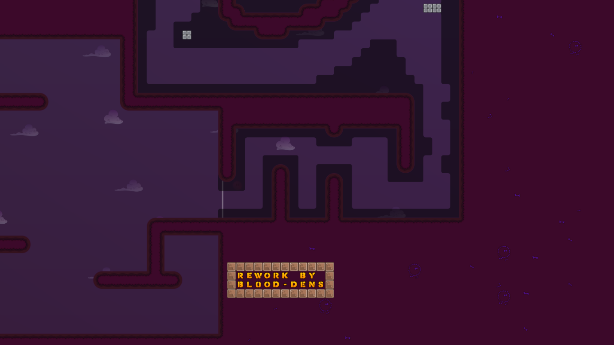

In this guide, we will be breaking down all the mapping rules for KoG. Follow all of these to make high-quality maps and to secure yourself a faster release.

## Gameplay

### 1. The map length must be at least 45 seconds of gameplay for the easy category and 90 seconds for every other category.

We want to offer the players a good amount of gameplay; therefore, your map needs to fulfill the requested map length. Test if your map is long enough by enabling Super and rushing through with full speed.

### 2. The gameplay must have variety as well as a level of creativity and uniqueness.

There are already a lot of existing Gores maps. Make your map differ from those by creating interesting gameplay. It does not always have to be something new; you can also create unique parts with basic gameplay elements other maps already use, but you should never copy parts of other maps.

Another thing to be aware of is forcing players to repeat the same move; instead, try to build a variety of parts that work differently.

Here are some parts from older maps that lack creativity and variety:

*This part from `Im_Climb5` is just going to the right for half a minute. This is uncreative and repetitive.*

*This part from `Kero-Gores3` is not as long but, compared to the part on `Im_Climb5`, it does not utilize flying freeze or hookables in the middle of the tunnel. In general, you do not want to map these kinds of tunnels. It is outdated gameplay which we have seen on many maps already.*

*This part from `FlipLipp19` just repeats one move over and over, which is a bad way to design parts. It gets old fast.*

Let us look at how you can improve on that:

*This part from `Mainiac` is a better approach to creating a unique experience. It forces players to do different moves within a short time, has specific save spots through scattering the availability of hookables, and has a distinguishing feature through only using 3x3 flying hookables and mostly 3-tile wide freeze.*

*Same goes for this part from `Vigorously`. There might be parts that work with a similar structure, but you will not see a part that looks like that on another map. It uses rectangular walls as an outer structure and a more rounded freeze path through the bottom half.*

*Parts do not necessarily need to utilize flying hookables or freeze to be good. This part from `Ckis_4_unskilledplayer` does it only passively and works well since it forces players to perform different moves while going left.*

**TIP:** Using passive flying hooks in tunnel-ish parts is an easy way to boost uniqueness.

Since standard gores is not that versatile when it comes to the core gameplay, choosing unique styles to differentiate your map from others will give your map an edge. Some mappers have developed their own unique style; other styles are more widespread. Style basically means the way you shape your freeze and hook tiles.

*The probably easiest-to-understand example is the map `bazawa`. It utilizes mostly 2-tilers. Combined with `bzw`’s mapping style, this makes for a unique experience.*

*The map `Stripes` uses, as the name suggests, stripes of freeze to shape its parts. This type of style, while not used as much in other maps as in this map, is more common.*

*If you look at `Bl0od4Miku`, you can see that the mapper, `Bl0od-Dens`, shaped the hookables in a special way. He created his personal mapping style, possibly the first there ever was. You only see this style on his maps or maps that are paying homage to him.*

There are many more styles on already existing maps and even more that haven’t been mapped yet. If you are a beginner, you don’t necessarily have to map in a specific style; this is more for advanced mappers. A personal style will come with time if you refine your mapping skills. However, something that you, even as a beginner, must always keep in mind is that shaping your parts with hookables is, in general, better than shaping them with freeze, and hookables with 1-tile-wide freeze should be the basis of your map since that is the most comfortable.

### 3. The difficulty cannot vary too much.

Having a map that stays around the same difficulty in every part is crucial. Hard maps that contain Main parts can be uninteresting for hard players. While Hard maps that contain Insane parts can be frustrating for hard players. Multiple factors influence the difficulty of a map: the difficulty of the moves players must perform, the saves, punishment, and some more minor things.

Here are some general descriptions for the main categories considering everything mentioned:

#### Easy

Easy maps are characterized by open spaces since new players cannot control their movement. They should contain a lot of platforms since it is often the only way players can save each other. Easy maps should rarely work with narrow ways, at maximum 3-tilers as the intended ways if it is not some special part. 1-tilers and 2-tilers are allowed to get used for skips. Parts are not allowed to be punishing, meaning you cannot design parts in a way where players can fall back a lot.

#### Main

Main maps still work with open spaces, but they can get tighter in higher-level Mains. 3-tile hammers or 1-tile up-downs are not allowed to be the intended save ways since Main players usually lack the skill to perform those. Main maps should utilize a lot of 3-tilers in lower and 2-tilers in higher-level Mains. It is also fine to use moves more suited for Hard maps like 1-tilers or long/90° 2-tilers but do not overuse them. Higher-level Mains are allowed to be punishing, especially longer ones.

#### Hard

Hard maps can still work with open spaces but must incorporate a lot of moves like 1-tilers or long/90° 2-tilers, but usually, the room the players have to work with is much tighter. They are allowed and encouraged to force 3-tile hammers, tight overhead hammers, 1-tile up-downs, or side-downs. But there can still be breathing spots and more chill parts. Also, 90° 1-tilers can get used carefully. From the Hard category onwards, you have freedom over designing punishing parts but don’t overdo it if it is not an Extreme map.

#### Insane/Extreme

Insane maps usually work with much more narrow space, tons of variations of 1-tilers, tight save spots, and are in general more difficult all over the board. You can experiment with anything but do not forget to incorporate save spaces. The same goes for Extreme maps. Those are generally just very long and difficult Insane maps.

Difficulty levels naturally vary by a bit, but you can reduce the range. If a move is easier than the average move difficulty of your map, you can make it harder to save or punishing. On the other hand, if a move is harder, you should make it easier to save or not punishing.

### 4. Finishing solo must be possible, and you must be able to go back at any point.

All gores maps are designed in a way that a player could finish them by themselves. Furthermore, since traveling back is important to help players who have failed behind, you must be able to go back at any point. Make sure that the way back is not significantly harder than the normal direction.

### 5. The gameplay needs to prevent players from blocking each other, especially in lower difficulties.

While playing Gores, you can get blocked by another player or block others yourself. Sometimes it can be increased or prevented depending on how you design a part.

*This part on `TomTom6`, for example, forces players to hook into an area where other players might be. While that is not a problem at this difficulty, you want to keep an eye on such things, especially on Easy and Main.*

*This part on `SkyrelOne` risks players falling on top of each other. While again, for this difficulty, it might not be a problem, a part with such a structure can be problematic on lower difficulties. Try to prevent mapping long sequences of moves where players can fall on each other.*

### 6. The spawn and start part must be big enough.

Since 64 players fit on a server, you must consider that up to 64 players might start their run at the same time. No start part will be able to fit 64 players, but you must do your best to make it comfortable for multiple people. The spawn also needs to be big enough. Keep an eye on where you place the spawn tiles. Place them on a flat surface with no edges nearby so players don’t waste their double jump.

There are some differences depending on the purpose of the map. Smaller, speedrun-like maps need to keep the spawn tiles close to the start line or a spot where players can get speed to start their run. They don’t need a long start part since they are rather short. Big team maps might need more spawn tiles, a bigger start room, and more space for the start part.

*This start part on `MorfeusGrydwin` is arguably the worst ever made. Never start your map like this. Always give players enough room to start and then increase the difficulty gradually to your desired one.*

### 7. Major gameplay skips are not allowed.

This includes wall skips, boat skips, and aled skips, which only need 2 or 3 players to work. Make sure to place enough freeze around places where those skips could be used. There are also Team 0 skips. Team 0 skips refer to skips on places where maps are open. Usually, the first players of a team can skip the last players through an open spot. Skipping a bit of a part is normal and happens on every map, but it should not be possible to skip too much. Sometimes skips can be achieved by hammering players far distances or by using large boats. Ensure players cannot get from one part of your map to another one, which would usually be far away due to no collision tiles like hookables or unhookables blocking the way. Also, watch out for spots where players could skip the start line. Ninja can completely skip touching the start; it can also skip through various other tiles. With speed and shotgun bug, you’re able to skip through a lot of not solid tiles like stoppers or even kill tiles.

## Design

### 1. Every important game tile must have a corresponding design tile.

Everything you place in the game layer must be marked accordingly. Every freeze game tile needs a freeze design tile; the same goes for all other tiles. Some tiles do not necessarily need to be marked, for example, if you have a solo on and off tile next to each other, you only need to mark one of them, depending on which is the more important one.

### 2. There must be distinctive differences between different tiles and markings.

This is self-explanatory. For example, you cannot use the same markings for teleport as for freeze. Players must understand a map without the need to use entities. If you are using special tiles like solo on/off, collision on/off, hammer on/off, and so on, be sure to mark them with their corresponding marking in `ddnet_tiles`.

### 3. The design cannot be too saturated or high/low in contrast.

Sometimes saturated designs work, but in general, you need to stay away from too saturated colors. Also, do not use too bright or too dark designs. Players must be able to see everything, but it cannot be too straining for the eyes.

### 4. Arrows and other hints must be marked in entities or marked with an Entities Off sign.

Everything that gives a hint in design must be marked with an “Entities off” sign, indices 190 and 191. Arrows can be used in entities through indices 64 or 65. These are usually for moving hearts, shields, or other things, so keep that in mind if you use them.

### 5. Background elements and distracting elements must be set to High Detail.

Everything that is not gameplay relevant must be set to High Detail (HD). To do that, you right-click the layer and set **Detail** to **Yes**. In general, every background element must be marked as HD. However, doodads in places where they do not distract, like the start room, can be left as non-HD. If you use a background image with details, create a separate background for non-HD.

### 6. The design must be finished.

That means there should be no design bugs in your map. Make sure everything is automapped correctly, every game tile has a corresponding design tile, there are no gaps between freeze and grass, for example, and no naked corners.

Additionally, keep your map file clean. Keep an eye on wrongly embedded or external images (red), remove unused images (blue), layers, groups, and envelopes (green), and keep the layer size as small as possible.

## Final Checks and Submission

If you want to test your map, create a LAN server, load it, and play it alone, or go to [trashmap.ddnet.tw](https://trashmap.ddnet.tw/) to create a server for testing it with your friends. Turn design and HD on and play your map. If you’re alone, take your dummy to save him at save spots. While testing the playability, check for bugs in the design. When you’re done, turn on `cl_overlay_entities 50` and play the map backwards. Now check if everything is backable while not being too unbalanced. Also, check for gameplay bugs like missing tiles or missing freeze behind walls. When you’re done, turn HD off, spectate your map, and actively search for bugs. When you find bugs, search again. When you think the gameplay is ready and you don’t find any bugs anymore, you can submit your map.

If you follow all these rules while mapping, less testing is needed, and your map will get released faster. Try out special styles and be creative with the gameplay to give your map a personal touch. But always keep the gameplay and design clean. A simple but clean map will have better chances to get released quickly than a creative but messy one.

We are looking forward to your submissions.
