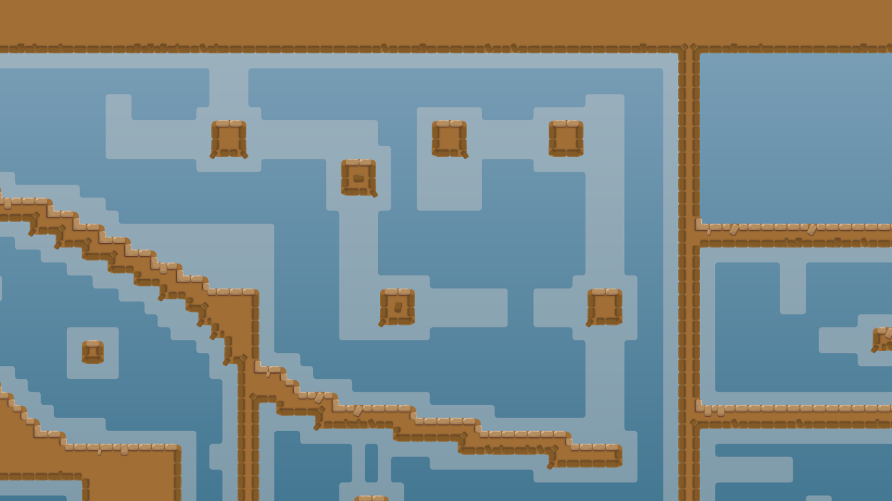

В этом руководстве мы разберем все правила создания карт для KoG. Следуйте этим советам, чтобы научиться делать качественные работы и обеспечить их быстрый релиз.

## Геймплей

### 1. Длина карты должна составлять не менее 45 секунд геймплея для категории «easy» и 90 секунд для всех остальных категорий.

Мы хотим предложить игрокам хорошую продолжительность геймплея, поэтому ваша карта должна соответствовать требуемой длине. Убедитесь, что ваша карта достаточно длинная, включив Super и промчавшись по ней на полной скорости.

### 2. Геймплей должен быть разнообразным, а также обладать определенным уровнем креативности и уникальности.

Уже существует множество хороших карт. Сделайте так, чтобы ваша карта отличалась от них, создав интересный геймплей. Это не всегда должно быть что-то новое; вы также можете создавать уникальные части, используя базовые механики геймплея, которые уже применяются в других картах. Однако никогда не копируйте части других карт.

Еще одна вещь, о которой стоит помнить — это заставлять игроков повторять одно и то же движение; вместо этого постарайтесь создать разнообразные части, которые работают по-разному.

Вот некоторые примеры частей из старых карт, которым не хватает креативности и разнообразия:

_Часть из `Im_Climb5` просто движется вправо в течение полуминуты. Это не креативно и повторяется._

_Эта часть из `Kero-Gores3` не такая длинная, но по сравнению с `Im_Climb5` она не использует летающий фриз или хук посередине туннеля. В целом, вам не надо создавать такие туннели. Это устаревший геймплей, который мы уже видели на многих картах._

_Эта часть из `FlipLipp19` просто повторяет одно движение снова и снова, что является плохим способом проектирования частей. Это быстро надоедает._

Давайте посмотрим, как вы можете это улучшить:

_Эта часть из `Mainiac` — лучший подход к созданию уникального опыта. Она заставляет игроков выполнять разные движения за короткий промежуток времени, имеет специальные места для спасения игроков благодаря разбросу доступных тайлов хука и имеет отличительную черту, используя только 3x3 летающий хук и в основном 3-х тайловый фриз._

_То же самое касается этой части из `Vigorously`. Возможно, есть места, которые работают по аналогичной структуре, но вы не увидите часть, которая выглядит так, как на другой карте. Она использует прямоугольные стены в качестве внешней структуры и более округлый фриз в нижней части._

_Части не обязательно должны использовать летающий хук или фриз, чтобы быть хорошими. Эта часть из `Ckis_4_unskilledplayer` делает это только пассивно и работает хорошо, так как заставляет игроков выполнять разные движения, двигаясь влево._

**СОВЕТ:** Использование пассивных летающих хуков в туннельных частях — простой способ повысить уникальность.

Поскольку стандартный фриз не так универсален в контексте основного геймплея, выбор уникальных стилей, которые помогут отличить вашу карту от других, придаст ей преимущество. Некоторые мапперы разработали свои уникальные стили, в то время как другие стили более распространены. Стиль в основном определяет, как вы оформляете свои тайлы фриза и хука.

_Вероятно, самым простым для понимания примером является карта `bazawa`. Она в основном использует 2-х тайловые части. В сочетании со стилем `bzw` это создает уникальный опыт._

_Карта `Stripes` использует, как следует из названия, полоски фриза для формирования своих частей. Этот стиль, хотя и не так часто встречается в других картах, как в этой, в целом более распространен._

_Если вы посмотрите на `Bl0od4Miku`, вы увидите, что маппер `Bl0od-Dens` сформировал хук особым образом. Он создал свой личный стиль маппинга, возможно, первый в своем роде.
Вы видите этот стиль только на его картах или картах, которые отдают ему дань уважения._

Существует много других стилей на уже существующих картах и еще больше, которые еще не были созданы. Если вы новичок, вам не обязательно следовать какому-то конкретному стилю; это больше для продвинутых мапперов. Личный стиль придет со временем, если вы будете совершенствовать свои навыки в создании карт. Тем не менее вы, даже как новичок, всегда должны помнить, что формирование ваших частей с помощью хука в целом лучше, чем формирование их с помощью фриза, и хук с 1 тайловым фризом должны быть основой вашей карты, поскольку это наиболее удобно.

### 3. Сложность не должна сильно варьироваться.

Наличие карты, которая сохраняет примерно одинаковую сложность на каждой части, имеет решающее значение. Hard карты, содержащие main части, могут быть неинтересными для опытных игроков. В то время как hard карты, содержащие insane части, могут быть разочаровывающими для опытных игроков. На сложность карты влияют несколько факторов: сложность движений, которые игроки должны выполнять, пространство для спасения игроков, наказания и некоторые менее значительные вещи.

Вот некоторые общие описания для основных категорий с учетом всего вышесказанного:

#### Easy

Easy карты характеризуются открытыми пространствами, так как новые игроки не могут контролировать свои движения. Они должны содержать много платформ, так как это часто единственный способ, которым игроки могут спасать друг друга. Easy карты редко должны работать с узкими путями, максимум 3-х тайловые, если это не какая-то специальная часть. 1 тайловые и 2-х тайловые могут использоваться для скипов. Части не должны быть наказуемыми, то есть вы не можете создавать части так, чтобы игроки могли часто падать назад вниз.

#### Main

Main карты все еще работают с открытыми пространствами, но могут становиться более узкими на картах более высокого уровня. 3-х тайловые удары молотком или 1 тайловые вверх-вниз не должны быть предполагаемыми путями спасения, так как игроки main уровня обычно не обладают навыками для выполнения таких движений. Main карты должны использовать много 3-х тайловые пути на более низком уровне и 2-х тайловые на более высоком уровне. Также допустимо использовать движения, более подходящие для hard карт, такие как 1 тайловые или длинные/90° 2-х тайловые пути, но не переусердствуйте с ними. Main карты более высокого уровня могут быть наказазуемыми, особенно более длинные.

#### Hard

Hard карты могут по-прежнему работать с открытыми пространствами, но должны включать много движений, таких как 1 тайловые или длинные/90° 2-х тайловые пути, но обычно пространство, с которым игроки могут работать, гораздо более ограничено. В качестве спасения игроков они могут и поощряются к использованию 3-х тайловых молотков, 1 тайловых вверх-вниз или боковых вниз. Но могут быть и места для брейка и более спокойные части. Также 90° 1 тайловые пути должны использоваться осторожно. Начиная с категории hard, у вас есть свобода в создании наказазуемых частей, но не переусердствуйте, если это не карта extreme уровня.

#### Insane/Extreme

Insane карты обычно работают с гораздо более узким пространством, множеством вариантов 1 тайловыми путями, узкими пространствами для спасения и в целом более сложны по всем параметрам. Вы можете экспериментировать с чем угодно, но не забывайте про пространства для спасения игроков. То же самое касается extreme карт. Это в целом просто очень длинные и сложные insane карты.

Уровни сложности естественно варьируются, но вы можете уменьшить диапазон. Если движение легче, чем средняя сложность движений вашей карты, вы можете сделать его более сложным для спасения или наказуемым. С другой стороны, если движение сложнее, вы должны сделать его легче для спасения или не наказуемым

### 4. Финиш в одиночку должен быть возможным, и вы должны иметь возможность вернуться назад в любой момент.

Все карты Gores спроектированы так, чтобы игрок мог финишировать их самостоятельно.
Более того, поскольку возможность вернуться назад важна для помощи игрокам, которые упали, вы должны иметь возможность вернуться в любой момент. Убедитесь, что путь назад не значительно сложнее, чем обычный путь.

### 5. Геймплей должен предотвращать блок игроков друг с другом, особенно на более низких уровнях сложности.

Во время игры в Gores вы можете быть заблокированы другим игроком или заблокировать других сами. Иногда это можно увеличить или предотвратить в зависимости от того, как вы проектируете часть.

_Эта часть на `TomTom6`, например, заставляет игроков зацепляться в области, где могут находиться другие игроки. Хотя это не является проблемой на этой сложности, вы должны следить за такими вещами, особенно на easy и main картах._

_Эта часть на `SkyrelOne` рискует тем, что игроки могут падать друг на друга. Хотя снова, для этой сложности это может не быть проблемой, часть с такой структурой может быть проблематичной на более низких уровнях сложности. Постарайтесь предотвратить создание длинных последовательностей движений, где игроки могут падать друг на друга._

### 6. Старт и спавн должны быть достаточно большими.

Поскольку на сервер помещается 64 игрока, вы должны учитывать, что все игроки могут начать свой забег одновременно. Никакой старт не сможет вместить 64 игрока, но вы должны сделать все возможное, чтобы сделать его комфортным для нескольких человек. Спавн также должен быть достаточно большим. Следите за тем, где вы размещаете тайлы старта. Размещайте их на ровной поверхности без близлежащих краев, чтобы игроки не тратили свой двойной прыжок.

Существуют некоторые различия в зависимости от предназначения карты. Более мелкие карты, предназначенные для спидранов, должны держать тайлы спавна близко к стартовой линии или месту, где игроки могут набрать скорость для начала своего забега. Им не нужна длинная начальная часть, так как они довольно короткие. Большие карты для команд могут потребовать больше тайлов спавна, и больше места для стартовой части.

_Этот старт на `MorfeusGrydwin` является худшей когда-либо созданной. Никогда не начинайте свою карту так. Всегда давайте игрокам достаточно места для старта, а затем постепенно увеличивайте сложность до желаемой._

### 7. Скипы геймплея не допускаются.

Сюда входят скипы с помощью стен, лодок и аледа, которые требуют всего 2 или 3 игрока. Убедитесь, что вокруг мест, где могут быть использованы эти скипы, достаточно фриза. Также есть скипы в /team 0. Такие пропуски относятся к местам, где карты открыты. Обычно первые игроки команды могут скипнуть последних игроков через открытое место. Пропускать такие части нормально и это происходит на каждой карте, но не должно быть возможности пропустить слишком много. Иногда скипы могут быть достигнуты, если игроки далеко кидают или используют большие лодки. Убедитесь, что игроки не могут перейти от одной части вашей карты к другой, которая обычно была бы далеко из-за отсутствия тайлов коллизии, таких как хук или анхук, блокирующие путь. Также следите за местами, где игроки могут пропустить стартовую линию. Ниндзя может полностью пропустить касание старта; он также может пропустить через различные другие тайлы. С помощью скорости и багов с дробовиком вы можете пропустить через множество тайлов, таких как стопперы или даже килл тайлы.

## Дизайн

### 1. Каждый важный игровой тайл должен иметь соответствующий дизайнерский тайл.

Все, что вы размещаете в игровом слое, должно быть соответствующим образом отмечено. Каждый игровой тайл фриза нуждается в дизайнерском тайле фриза; то же самое касается всех других тайлов. Некоторые тайлы не обязательно должны быть отмечены. Например, если у вас есть тайлы соло/ансоло рядом друг с другом, вам нужно отметить только один из них, в зависимости от того, какой более важен.

### 2. Должны быть четкие различия между различными тайлами и обозначениями.

Вы не можете использовать одинаковые обозначения для телепорта и фриза. Игроки должны понимать карту без необходимости использовать entities. Если вы используете специальные тайлы, такие как включение/выключение соло, включение/выключение коллизии, включение/выключение молота и так далее, убедитесь, что вы отметили их в `ddnet_tiles`.

### 3. Дизайн не должен быть слишком насыщенным или слишком контрастным.

Иногда насыщенные дизайны работают, но в целом вам следует избегать слишком насыщенных цветов. Также не используйте слишком яркие или слишком темные дизайны. Игроки должны видеть все, но это не должно быть утомительно для глаз.

### 4. Стрелки и другие подсказки должны быть отмечены в entities или помечены знаком "Entities Off".

Все, что дает подсказку в дизайне, должно быть отмечено знаком "Entities off", индексы 190 и 191. Стрелки могут использоваться в entities через индексы 64 или 65. Эти индексы обычно предназначены для движущихся сердечек, щитов или других вещей, так что имейте это в виду, если вы их используете.

### 5. Части фона и отвлекающие части должны быть установлены на высокий уровень детализации.

Все, что не имеет отношения к геймплею, должно быть установлено на высокий уровень детализации (HD). Для этого щелкните правой кнопкой мыши по слою и установите Details на Yes. В общем, каждая часть фона должна быть отмечена как HD. Однако декорации в местах, где они не отвлекают, такие как спавн, могут быть оставлены как не-HD. Если вы используете фоновое изображение с деталями, создайте отдельный фон для не-HD.

### 6. Дизайн должен быть завершен.

Это означает, что в вашей карте не должно быть дизайнерских багов. Убедитесь, что все автоматически сопоставлено правильно, каждый игровой тайл имеет соответствующий дизайнерский тайл, между фризом и травой, например, нет промежутков, и нет голых углов.

Кроме того, следите за чистотой вашего файла карты. Обратите внимание на неправильно встроенные или внешние изображения (красный), удалите неиспользуемые изображения (синий), слои, группы и конверты (зеленый) и держите размер файла как можно меньшим.

## Последние проверки и отправка

Если вы хотите протестировать свою карту, создайте LAN сервер, загрузите ее и играйте в одиночку или перейдите на [trashmap.ddnet.tw](https://trashmap.ddnet.tw/), чтобы создать сервер для тестирования с друзьями. Включите дизайн и HD и играйте в свою карту. Если вы одни, возьмите своего дамми, чтобы проверить пространство для спасения игроков. Во время тестирования играбельности проверяйте наличие багов в дизайне. Когда вы закончите, включите `cl_overlay_entities 50` и играйте в карту задом наперед. Теперь проверьте, везде ли можно вернуться назад, не создавая слишком большого дисбаланса. Также проверьте наличие багов в геймплее, таких как отсутствующие тайлы или отсутствующий фриз за стенами. Когда вы закончите, выключите HD, и посмотрите на свою карту, активно ища баги. Когда вы их найдете, ищите снова. Когда вы думаете, что геймплей готов и больше не находите багов, вы можете выкладывать свою карту в #submit_maps .

Если вы будете следовать всем этим правилам, потребуется меньше времени тестирования, и ваша карта будет выпущена быстрее. Пробуйте разные стили и будьте креативными с геймплеем, чтобы придать вашей карте индивидуальность. Но всегда держите геймплей и дизайн в чистоте. Простая, но аккуратная карта будет иметь больше шансов на быстрый релиз, чем креативная, но беспорядочная.
